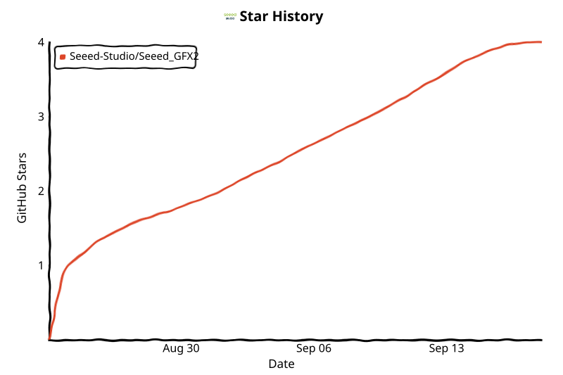

> [!NOTE]
> **The fully optimized successor to Seeed_GFX — please choose Seeed_GFX2**
>
> Seeed_GFX2 is a comprehensively optimized rewrite of [Seeed_GFX](https://github.com/Seeed-Studio/Seeed_GFX). Whether you are starting a new project or maintaining an existing Seeed_GFX project, please choose Seeed_GFX2: it keeps the familiar drawing API (with compatibility wrappers) while fixing the pain points of the old library.
>
> What was optimized compared to Seeed_GFX:
>
> | | Seeed_GFX | Seeed_GFX2 |
> |---|---|---|
> | Base | Fork of TFT_eSPI | Original work (MIT) |
> | Hardware setup | Edit `User_Setup.h` at build time | Product catalog, no pin setup needed |
> | Architecture | Single class + ePaper class | Layered *Board → Bus → Driver → Panel* |
> | ePaper memory | Full frame buffers | Packed 1/2/4-bit buffers |
> | Error handling | Silent / return codes | `GfxResult` + `capabilities()` |
> | UI & touch | External `TFT_eWidget` | Built-in retained-mode UI + touch |
> | Official products | XIAO, Wio Terminal | Plus reTerminal E series, SenseCAP Watcher, SenseCAP Indicator |

# Seeed_GFX2

A layered Arduino graphics library for TFT, OLED, and ePaper displays, built for Seeed Studio hardware platforms.

## Key Features

- **Unified API** — Consistent programming interface across TFT, OLED, and ePaper displays
- **Layered Architecture** — Clean separation of Board → Bus → Driver → Panel → Application
- **Product Catalog** — Pre-configured profiles for official Seeed products, no manual pin setup needed
- **ePaper Support** — Full and partial refresh, fast refresh, temperature compensation, and packed frame buffers
- **Optional Lightweight UI** — Retained-mode UI layer with widgets, focus management, input handling, and dirty-region rendering
- **Touch Support** — Explicit touch controller attachment with flexible delegation
- **Error Handling** — `GfxResult` return types instead of silent failures

## Supported Platforms

### Core Hardware Support
- Wio Terminal
- XIAO SAMD21 / RP2040 / RP2350 / RA4M1 / MG24
- XIAO ESP32C3 / ESP32C5 / ESP32C6 / ESP32S2 / ESP32S3 (and S3 variants)
- XIAO nRF52840 / nRF52840 Plus / nRF54L15 / nRF54LM20A
- XIAO LCD Board, XIAO ePaper Breakout Boards
- reTerminal E1001 / E1002 / E1003 / E1004
- SenseCAP Watcher, SenseCAP Indicator GX / DX

### Supported Displays

**TFT / LCD**

| # | Display |
|---|---------|
| 1 | [Round Display for Seeed Studio XIAO](https://www.seeedstudio.com/1-28-Round-Touch-Display-for-Seeed-Studio-XIAO-ESP32.html) |
| 2 | [1.47-inch LCD SPI Display](https://www.seeedstudio.com/1-47inch-172x320-Resolution-LCD-Display-Module-p-5756.html) |
| 3 | [1.69-inch LCD SPI Display](https://www.seeedstudio.com/1-69inch-240-280-Resolution-IPS-LCD-Display-Module-p-5755.html) |
| 4 | 0.96-inch Display (XIAO ESP32-S3 Plus) |
| 5 | 0.96-inch Display (XIAO nRF52840 Plus) |
| 6 | 1.14-inch Display (XIAO ESP32-S3 Plus) |
| 7 | 1.14-inch Display (XIAO nRF52840 Plus) |
| 8 | 1.47-inch Touch Display (XIAO ESP32-S3 Plus) |
| 9 | 1.47-inch Touch Display (XIAO nRF52840 Plus) |
| 10 | [Wio Terminal](https://www.seeedstudio.com/Wio-Terminal-p-4509.html) |
| 11 | [SenseCAP Indicator](https://www.seeedstudio.com/SenseCAP-Indicator-D1-p-5643.html) |
| 12 | [SenseCAP Watcher](https://www.seeedstudio.com/SenseCAP-Watcher-XIAOZHI-EN-p-6532.html) |

**ePaper — Monochrome (Black/White)**

| # | Display |
|---|---------|
| 1 | [1.54-inch ePaper Display (BW)](https://www.seeedstudio.com/1-54-Monochrome-ePaper-Display-with-200x200-Pixels-p-5776.html) |
| 2 | [2.13-inch ePaper Display (BW)](https://www.seeedstudio.com/2-13-Monochrome-ePaper-Display-with-122x250-Pixels-p-5778.html) |
| 3 | [2.9-inch ePaper Display (BW)](https://www.seeedstudio.com/2-9-Monochrome-ePaper-Display-with-296x128-Pixels-p-5782.html) |
| 4 | [2.9-inch Flex ePaper Display (BW)](https://www.seeedstudio.com/2-9-Flexible-Monochrome-ePaper-Display-with-296x128-Pixels-p-5780.html) |
| 5 | [4.2-inch ePaper Display (BW)](https://www.seeedstudio.com/4-2-Monochrome-ePaper-Display-with-400x300-Pixels-p-5784.html) |
| 6 | [4.26-inch ePaper Display (BW)](https://www.seeedstudio.com/4-26-Monochrome-SPI-ePaper-Display-p-6398.html) |
| 7 | [5.83-inch ePaper Display (BW)](https://www.seeedstudio.com/5-83-Monochrome-ePaper-Display-with-648x480-Pixels-p-5785.html) |
| 8 | [7.5-inch ePaper Display (BW)](https://www.seeedstudio.com/7-5-Monochrome-ePaper-Display-with-800x480-Pixels-p-5788.html) |
| 9 | [10.3-inch ePaper Display (BW)](https://www.seeedstudio.com/10-3inch-Monochrome-eInk-ePaper-Display-with-1404x1872-Pixels-p-6568.html) |

**ePaper — Quadruple Color (BWRY: Black/White/Red/Yellow)**

| # | Display |
|---|---------|
| 1 | [2.13-inch ePaper Display (BWRY)](https://www.seeedstudio.com/2-13-Quadruple-Color-ePaper-Display-with-122x250-Pixels-p-5779.html) |
| 2 | [2.9-inch ePaper Display (BWRY)](https://www.seeedstudio.com/2-9-Quadruple-Color-ePaper-Display-with-128x296-Pixels-p-5783.html) |

**ePaper — Spectra 6 (Black/White/Red/Yellow/Blue/Green)**

| # | Display |
|---|---------|
| 1 | [7.3-inch ePaper Display (Spectra 6)](https://www.seeedstudio.com/7-3inch-Six-Color-eInk-ePaper-Display-with-800x480-Pixels-p-6567.html) |
| 2 | [13.3-inch ePaper Display (Spectra 6)](https://www.seeedstudio.com/13-3inch-Six-Color-eInk-ePaper-Display-with-1200x1600-Pixels-p-6569.html) |
| 3 | 7.09-inch ePaper Display (Spectra 6) |

**reTerminal Series**

| # | Display |
|---|---------|
| 1 | [reTerminal E1001](https://www.seeedstudio.com/reTerminal-E1001-p-6534.html) |
| 2 | [reTerminal E1002](https://www.seeedstudio.com/reTerminal-E1002-p-6533.html) |
| 3 | [reTerminal E1003](https://www.seeedstudio.com/reTerminal-E1003-p-6731.html) |
| 4 | [reTerminal E1004](https://www.seeedstudio.com/reTerminal-E1004-p-6692.html) |
| 5 | [reTerminal Sticky](https://www.seeedstudio.com/reTerminal-Sticky-p-6861.html) |

### Display Driver IC
- **TFT LCD** — ST7735, ST7789, ILI9341, ILI9488, GC9A01, SSD1351, SPD2010, JD9853A, RGB565
- **OLED** — SSD1306 (I2C)
- **ePaper** — SSD1677, SSD1680, SSD1681, SSD1683, SSD2677, UC8151D, UC8179, ED2208, ED103TC2, T133A01, IT8951, JD79660, JD79667, JD79676, JD79686B, GDEB0709E01

> **Note:** When using a large-sized screen (≥ 10.3 inch), please make sure to enable PSRAM. Otherwise, you will receive a memory error prompt.

## Architecture

```text
Application
  -> Seeed_GFX graphics API
  -> DisplayInstance (lifetime and initialization)
  -> Panel (TFT / OLED / ePaper)
  -> Controller Driver
  -> Bus (SPI / I2C / Parallel8 / QSPI / RGB)
  -> Board / platform GPIO
```

Official products are described by the product catalog. The graphics class does not contain a central hardware switch and does not initialize hardware from its constructor.

## ePaper Implementation

The library includes a comprehensive implementation for ePaper displays, providing:

- **Multi-Driver Support** — ePaper drivers covering Seeed's ePaper products
- **Packed Frame Buffers** — Memory-efficient 1/2/4-bit per pixel storage
- **Partial & Fast Refresh** — Region-specific updates for improved performance
- **Temperature Compensation** — Automatic adjustment for environmental conditions
- **Power Management** — Automatic sleep/wake cycles to maximize battery life
- **Display Orientation** — Flexible orientation via configurable mirroring

```cpp
#include <Seeed_GFX.h>

Seeed_GFX display(Seeed_Product::Seeed_ePaper_1INCH54);

void setup() {
    display.begin();
    display.fillScreen(TFT_WHITE);
    display.drawString("Hello ePaper", 10, 10, 2);
    display.refresh();  // Update the display
}
```

## Technical Enhancements

### Processor-Specific Optimizations
- Specialized implementations for SAMD21, RA4M1, nRF52840, and MG24 processors
- Expanded ESP32 variant support including C3, C5, C6, S2, and S3 models
- Register-level optimizations for each platform

### Bus Architecture
- SPI, I2C, Parallel8, QSPI, and RGB bus support
- DMA acceleration where supported by hardware
- Custom pin configurations for Seeed development boards

### Capabilities Detection
- Runtime capability querying via `display.capabilities()`
- Readback, partial refresh, fast refresh, and temperature compensation support detection
- `GfxResult` return types for reliable error handling

## Example Applications

The library includes numerous examples organized by product name:

- **Basic Graphics** — Drawing, text rendering, color operations
- **Sprite Manipulation** — Advanced sprite creation and transformation
- **ePaper Applications** — Full/partial refresh, bitmap display, custom demos
- **UI Examples** — Menu navigation, page stacks, input handling
- **Bitmap Display** — Image rendering from memory and SD card

Start with [`examples/README.md`](examples/README.md) to choose the exact display, driver board, or reTerminal model before opening a sketch.

## Installation

1. Download this repository
2. Place it in your Arduino `libraries` folder
3. Restart the Arduino IDE
4. Open an example from `File → Examples → Seeed_GFX2`

## Documentation

- [API Reference](docs/API_Reference.md) — Complete API overview
- [Examples](examples/) — Platform-specific usage guidance

## License

This library is original work by Seeed Studio and is licensed under the **MIT License**. See [LICENSE](LICENSE) for the full text.

Third-party components included in this project (e.g., fonts, tools) are covered by their own licenses. Refer to the [LICENSE](LICENSE) file for details.

## Star History

<p align="center">
<picture>
  <source media="(prefers-color-scheme: dark)" 
          srcset="assets/star-history/star-history-dark.svg">

  <source media="(prefers-color-scheme: light)" 
          srcset="assets/star-history/star-history-light.svg">

  
</picture>
</p>